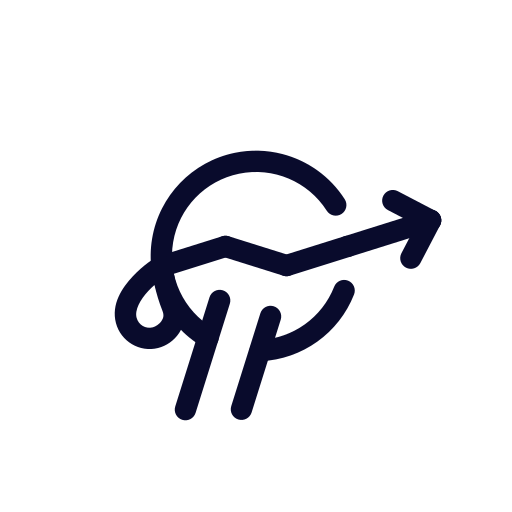
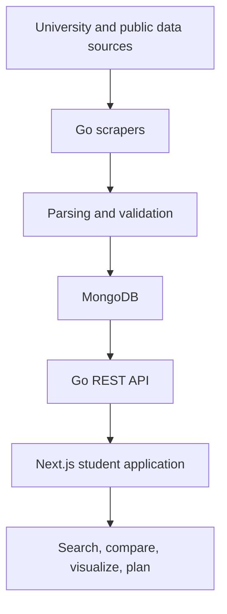

<p align="center">
  
</p>

<h1 align="center">Nebula Labs</h1>

<p align="center">
  A full-stack academic intelligence platform for exploring courses, professors,
  grade distributions, schedules, and university data in one place.
</p>

<p align="center">
  
  
  
  
  
</p>

---

## The product

Nebula Labs brings fragmented academic information into a single student-facing
experience. Instead of jumping between course catalogs, historical grade data,
professor-review sites, and planning tools, students can search and compare the
information that matters before building a schedule.

### Student experience

- **Search courses and professors** using structured filters and autocomplete.
- **Explore grade distributions** across semesters, sections, and instructors.
- **Compare multiple options** on the same table or visualization.
- **Review professor context** alongside official academic data.
- **Build and evaluate schedules** through the integrated planning experience.
- **Navigate responsive dashboards** built for fast, repeatable research.

## Full-stack architecture



The repository keeps the product, API, and ingestion pipeline together so
changes can be traced from the original data source through validation and API
contracts to the final user interface.

## Monorepo structure

| Path | Responsibility | Technologies |
| --- | --- | --- |
| [`apps/utd-trends`](apps/utd-trends) | Student-facing search, comparison, dashboard, charting, and planning experience | Next.js, React, TypeScript, Material UI, ApexCharts, Jest |
| [`services/nebula-api`](services/nebula-api) | REST endpoints, controllers, schemas, persistence, and API documentation | Go, Gin, MongoDB, Swagger |
| [`services/api-tools`](services/api-tools) | Data collection, parsing, validation, normalization, and upload workflows | Go, ChromeDP, structured parsers |

## Engineering highlights

- End-to-end pipeline from public data collection to student-facing visualization.
- Typed API contracts with JSON and BSON mappings.
- Multi-source course and professor aggregation across academic terms.
- Search, filtering, comparison, and graph-based exploration workflows.
- Automated tests across frontend utilities, parsers, uploaders, and API schemas.
- Scholarship schema coverage for serialization, MongoDB IDs, numeric values,
  and list round trips.
- Documented contribution and review process with preserved upstream histories.

## Run the frontend

### Requirements

- Node.js 22
- npm

```bash
git clone https://github.com/joshuaraja1/Nebula-Labs.git
cd Nebula-Labs/apps/utd-trends
cp .env.example .env.local
npm install
npm run dev
```

Open [http://localhost:3000](http://localhost:3000).

Useful checks:

```bash
npm test
npm run lint:check
npm run format:check
npm run type:check
```

## Run the API

### Requirements

- Go 1.26 or newer
- MongoDB access for persistent data

```bash
cd services/nebula-api
cp .env.template .env
make setup
go test ./...
make build
./rest-api
```

The API normally serves locally on port `8080`. Environment-dependent routes
require the values documented in `.env.template`.

## Run the data pipeline

```bash
cd services/api-tools
make setup
go test ./...
make build
./api-tools
```

The CLI supports separate scrape, parse, validate, and upload stages. See the
[data-tools guide](services/api-tools/README.md) for command-level options.

## Recent repository work

- Consolidated the product frontend, REST API, and ingestion tools into one
  full-stack repository.
- Added package and function documentation for shared API utilities.
- Added a typed scholarship domain model and serialization tests.
- Added repository-level onboarding, testing, and pull-request guidance.
- Preserved component histories and original MIT license notices.

## Roadmap

- Replace upstream-specific deployment configuration with independent adapters.
- Add monorepo CI for TypeScript, Go, formatting, and contract tests.
- Expand accessibility and responsive test coverage.
- Add end-to-end tests for course search, comparison, and planning.
- Strengthen observability across ingestion jobs and API requests.

## Contributing

Contributions are welcome. Start with [CONTRIBUTING.md](CONTRIBUTING.md) for
branch naming, local verification, commit expectations, and the pull-request
checklist.

## Attribution and licensing

This is an independent derivative of the MIT-licensed
[UTDNebula/utd-trends](https://github.com/UTDNebula/utd-trends),
[UTDNebula/nebula-api](https://github.com/UTDNebula/nebula-api), and
[UTDNebula/api-tools](https://github.com/UTDNebula/api-tools) projects. It is
not presented as the official UTD Nebula organization or production service.

The imported histories and original MIT license notices remain intact. See
[NOTICE.md](NOTICE.md) and each component's `LICENSE` file.
